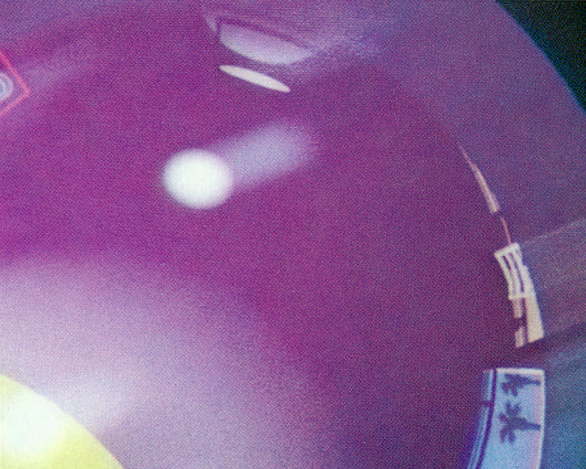

Pool1984
========

This project attempts to recreate the "Pixar 1984 pool ball shot", mentioned in the paper "Distributed
Ray Tracing" by Robert L. Cook, Thomas Porter and Loren Carpenter (1984) which can be found [here](https://graphics.pixar.com/library/DistributedRayTracing/). The principles described in this paper will be used to recreate the picture, 
which can be found at the end of the paper and also on the web page as a thumbnail. Ironically, the
[thumbnail](http://graphics.pixar.com/library/DistributedRayTracing/thumbNail.png), which in reality is an image of 778x669 pixels is the best quality we have.
Another paper "Stochastic Sampling in Computer Graphics" by Robert L. Cook (1986) contains a close-up 
of "1984" which we will use as well. This picture reveals a lot of details which we will use
to reconstruct the environt map later on. The problem with this picture is that is a scan of a printed
document (with halftone dots), it is slightly skewed/rotated and the colors are off. I used a drawing
program (Paint.NET) to correct the close-up as much as possible:

Strategy
--------
To reconstruct the 1984 picture, we need to perform the following steps:
* Establish the 3D-model of the scene, including camera parameters and light positions.
* Find the orientation of the ball textures (the numbers) and extract their original 2D representation.
This will be used to recreate 'clean' textures which will be used in the final rendering.
* Calibrate colors, light intensities, amount of reflection
* Extract the environment map as accurate as possible, interpret the visual information and recreate
'clean' a clean environment map.
* And the hardest part: establish the motion blur: positions and velocities of the balls in time

